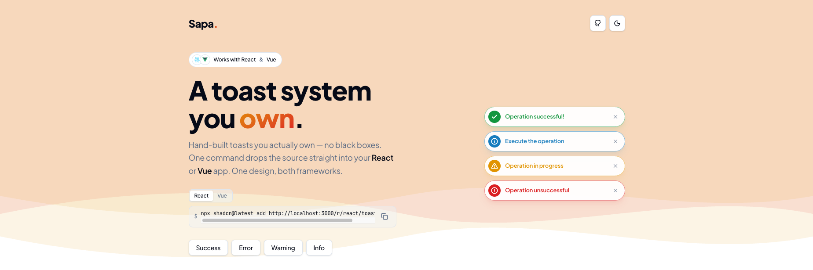

# Sapa.

Your own cross-framework component **registry** — a custom-built toast you install into **React** & **Vue** with one command.

_Copy, paste, own it. Same design, two frameworks._



---

## Features

- **Cross-framework** — one registry, two authored sources (`.tsx` + `.vue`).
- **Custom-built** — written from scratch on framework primitives (no `sonner` / `vue-sonner`).
- **Rich colors** — semantic success / error / warning / info with a pill design.
- **Directional motion** — toasts exit toward their anchor; swipe to dismiss (sideways for corners, up/down for centered).
- **Variants** — default, types, description, action, promise, progress, custom content, positions.
- **Theme-aware** — light & dark via CSS variables.
- **Accessible** — `aria-live` announcements, keyboard-focusable dismiss, honors `prefers-reduced-motion`.

## Install into your project

The registry is served as JSON. Add it with the shadcn CLI:

```bash
# React
npx shadcn@latest add https://sapa-registry.vercel.app/r/react/toaster.json

# Vue
npx shadcn-vue@latest add https://sapa-registry.vercel.app/r/vue/toaster.json
```

Files land in `components/ui/sapa-toast/`. Optional demo variants:
`.../r/react/toast-types.json`, `toast-promise.json`, `toast-positions.json`, …

Mount the toaster once, then call the API anywhere:

```tsx
// React — e.g. app/layout.tsx
import { Toaster, toast } from "@/components/ui/sapa-toast/toaster";

// <Toaster richColors position="bottom-right" />
toast.success("Saved", { description: "All changes stored." });
```

```vue
<!-- Vue — e.g. App.vue -->
<script setup>
import Toaster from "@/components/ui/sapa-toast/Toaster.vue";
import { toast } from "@/components/ui/sapa-toast/useToast";
</script>

<template>
  <Toaster rich-colors position="bottom-right" />
</template>
<!-- toast.success("Saved", { description: "All changes stored." }) -->
```

## Toast API (identical in both frameworks)

`toast(msg, opts)` · `toast.success / error / warning / info(msg, opts)` ·
`toast.loading` · `toast.progress(msg, { value })` ·
`toast.promise(p, { loading, success, error })` ·
`toast.custom(node/component)` · `toast.dismiss(id?)`

**Options:** `title`, `description`, `duration` (`Infinity` to persist), `position`,
`variant` (`"default" | "outline" | "filled" | "accent"`), `size` (`"sm" | "default" | "lg"`),
`action`, `cancel`, `icon`, `progress` (0–100).

`variant` picks the visual treatment — `filled` (solid color), `outline` (tinted
border/title), `accent` (colored left bar), or the neutral `default`. `richColors: true`
is still accepted as a deprecated alias for `variant: "outline"`. Set defaults for every
toast on the `<Toaster variant="…" size="…" />`.

## Repository layout

```
sapa/
├── registry.json              # source of truth — every item (React + Vue)
├── registry/
│   ├── theme/globals.css      # shared design tokens (framework-agnostic)
│   ├── react/                 # .tsx toast: store + <Toaster/> + <Toast/> + examples
│   └── vue/                   # .vue toast: reactive store + Toaster/Toast + examples
├── scripts/build-registry.mjs # inlines files → apps/registry/public/r/*.json
└── apps/
    ├── registry/              # Next.js showcase (live React preview, code + CLI copy)
    └── vue-sandbox/           # Vite + Vue app to verify the .vue items render
```

## Develop

```bash
pnpm install
pnpm dev            # Next.js showcase → http://localhost:3000  (auto-runs registry:build)
pnpm sandbox        # Vue sandbox      → http://localhost:5174
pnpm registry:build # regenerate apps/registry/public/r/*.json
```
